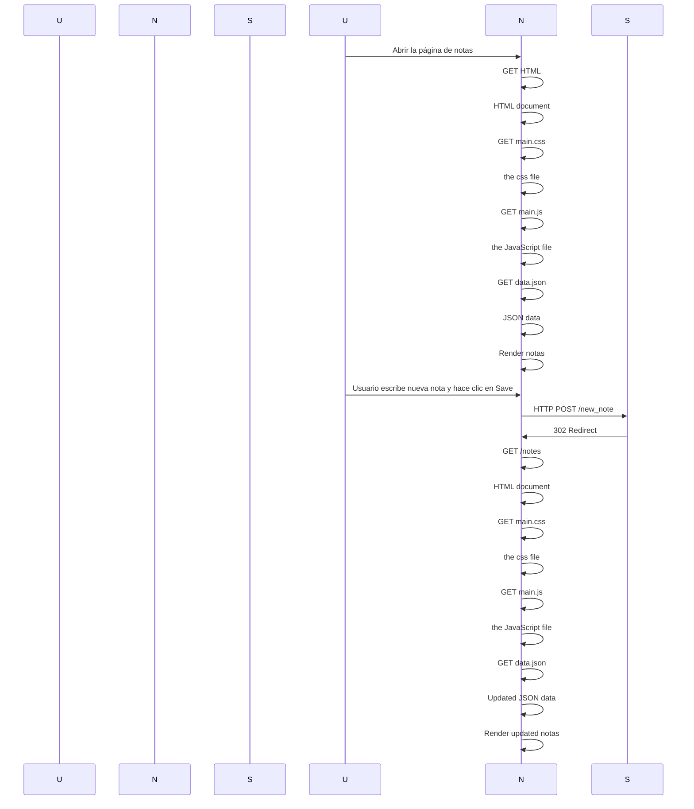

```mermaid
sequenceDiagram
    participant Usuario as U
    participant Navegador as N
    participant Servidor as S

    U->>N: Abrir la página de notas
    N->>N: GET HTML
    N->>N: HTML document
    N->>N: GET main.css
    N->>N: the css file
    N->>N: GET main.js
    N->>N: the JavaScript file
    N->>N: GET data.json
    N->>N: JSON data
    N->>N: Render notas
    U->>N: Usuario escribe nueva nota y hace clic en Save
    N->>S: HTTP POST /new_note
    S->>N: 302 Redirect
    N->>N: GET /notes
    N->>N: HTML document
    N->>N: GET main.css
    N->>N: the css file
    N->>N: GET main.js
    N->>N: the JavaScript file
    N->>N: GET data.json
    N->>N: Updated JSON data
    N->>N: Render updated notas
```
