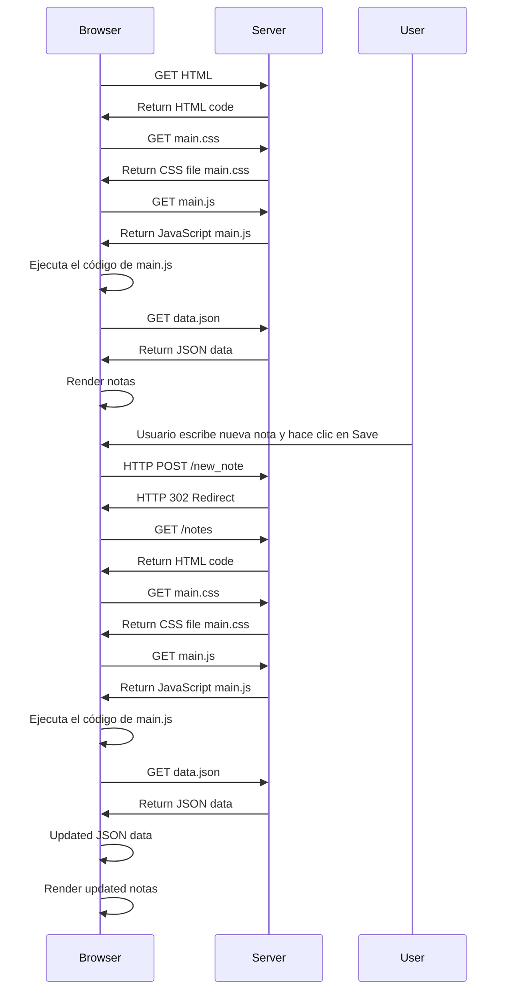

```mermaid
sequenceDiagram
    Browser->>Server: GET HTML
    Server->>Browser: Return HTML code
    Browser->>Server: GET main.css
    Server->>Browser: Return CSS file main.css
    Browser->>Server: GET main.js
    Server->>Browser: Return JavaScript main.js
    Browser->>Browser: Ejecuta el código de main.js
    Browser->>Server: GET data.json
    Server->>Browser: Return JSON data
    Browser->>Browser: Render notas
    User->>Browser: Usuario escribe nueva nota y hace clic en Save
    Browser->>Server: HTTP POST /new_note
    Server->>Browser: HTTP 302 Redirect
    Browser->>Server: GET /notes
    Server->>Browser: Return HTML code
    Browser->>Server: GET main.css
    Server->>Browser: Return CSS file main.css
    Browser->>Server: GET main.js
    Server->>Browser: Return JavaScript main.js
    Browser->>Browser: Ejecuta el código de main.js
    Browser->>Server: GET data.json
    Server->>Browser: Return JSON data
    Browser->>Browser: Updated JSON data
    Browser->>Browser: Render updated notas
```
