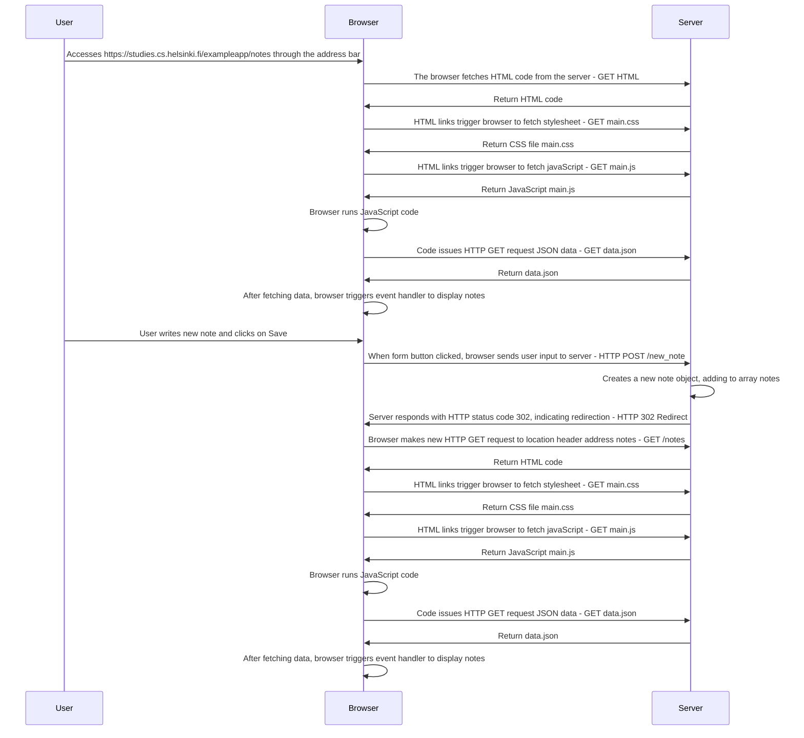

```mermaid
sequenceDiagram
    User->>Browser: Accesses https://studies.cs.helsinki.fi/exampleapp/notes through the address bar
    Browser->>Server: The browser fetches HTML code from the server - GET HTML
    Server->>Browser: Return HTML code
    Browser->>Server: HTML links trigger browser to fetch stylesheet - GET main.css
    Server->>Browser: Return CSS file main.css
    Browser->>Server: HTML links trigger browser to fetch javaScript - GET main.js
    Server->>Browser: Return JavaScript main.js
    Browser->>Browser: Browser runs JavaScript code 
    Browser->>Server: Code issues HTTP GET request JSON data - GET data.json
    Server->>Browser: Return data.json
    Browser->>Browser: After fetching data, browser triggers event handler to display notes
    User->>Browser: User writes new note and clicks on Save
    Browser->>Server: When form button clicked, browser sends user input to server - HTTP POST /new_note
    Server->>Server: Creates a new note object, adding to array notes
    Server->>Browser: Server responds with HTTP status code 302, indicating redirection - HTTP 302 Redirect
    Browser->>Server: Browser makes new HTTP GET request to location header address notes - GET /notes
    Server->>Browser: Return HTML code 
    Browser->>Server: HTML links trigger browser to fetch stylesheet - GET main.css
    Server->>Browser: Return CSS file main.css
    Browser->>Server: HTML links trigger browser to fetch javaScript - GET main.js
    Server->>Browser: Return JavaScript main.js
    Browser->>Browser: Browser runs JavaScript code 
    Browser->>Server: Code issues HTTP GET request JSON data - GET data.json
    Server->>Browser: Return data.json
    Browser->>Browser: After fetching data, browser triggers event handler to display notes
```
